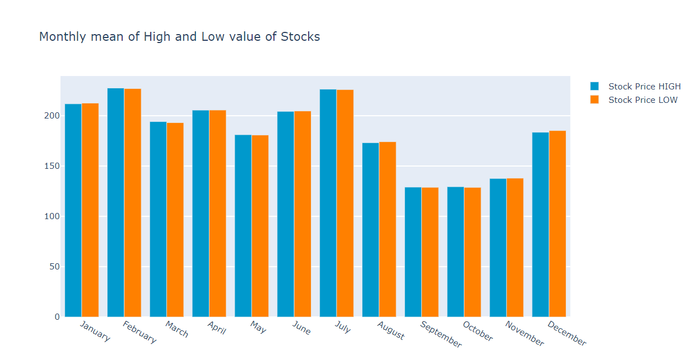

# Data-Visualization
It is a portfolio project on data visualization of Stock value of Tesla from 2016-08-16 to 2021-08-13.

Unfortunately I couldn't display the plotly graph outputs along with the code so I have uploaded them here for your review.

1.) This first output below shows the difference between mean of Open Stock pricees of each day in a particular month to the mean of Closing Stock price of each each day in a particular month.

