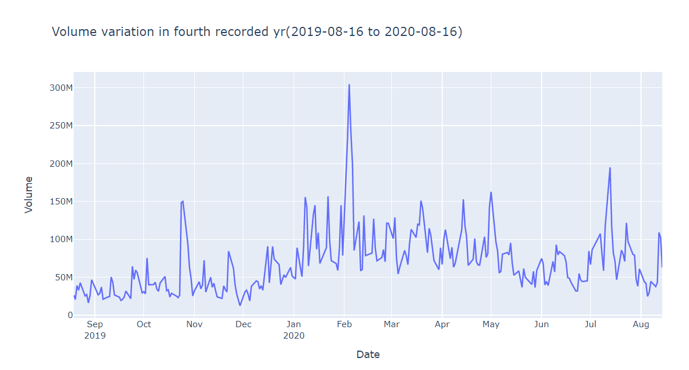

# Data-Visualization
It is a portfolio project on data visualization of Stock value of Tesla from 2016-08-16 to 2021-08-13.

Unfortunately I couldn't display the plotly graph outputs along with the code so I have uploaded them here for your review.

1.) This first output below shows the difference between the mean of Open Stock prices of each day for every month to the mean of Closing Stock price of each day for every month.

2.) This second output below shows the difference between the Maximum value of "High" in a particular day for each month to the Minimum value of "Low" in a particular day for each month.

3.) This third output below shows the variation of all features(except Volume) of stocks for the first recorded year.

4.) This fourth output below shows the variation of all features(except Volume) of stocks for the second recorded year.

5.) This fifth output below shows the variation of all features(except Volume) of stocks for the third recorded year.

6.) This sixth output below shows the variation of all features(except Volume) of stocks for the fourth recorded year.

7.) This seventh output below shows the variation of all features(except Volume) of stocks for the fifth recorded year.

8.) This eighth output below shows the variation of "Volume" feature of stocks for the first recorded year.

9.) This nineth output below shows the variation of "Volume" feature of stocks for the second recorded year.

10.) This tenth output below shows the variation of "Volume" feature of stocks for the third recorded year.

11.) This eleventh output below shows the variation of "Volume" feature of stocks for the fourth recorded year.

12.) This twelveth output below shows the variation of "Volume" feature of stocks for the fifth recorded year.

13.) This thirteenth output below shows the variation of the mean of "Close" feature of Stock of each day for every month.

14.) This fouteenth output below shows the variation of the mean of "Volume" feature of Stock of each day for every month.

